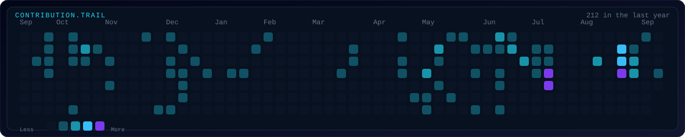

<!-- Generated by GitHub Profile Agent Console. Edit profile.config.json, then run npm run generate. -->

  <picture>
    <source media="(max-width: 760px) and (prefers-color-scheme: dark)" srcset="./assets/hero/agent-console-8f279b2f-mobile-dark.svg">
    <source media="(max-width: 760px)" srcset="./assets/hero/agent-console-8f279b2f-mobile-light.svg">
    <source media="(prefers-color-scheme: dark)" srcset="./assets/hero/agent-console-8f279b2f-dark.svg">
    <source media="(prefers-color-scheme: light)" srcset="./assets/hero/agent-console-8f279b2f-light.svg">
    
  </picture>

  
  
  

## About Me

Frontend Developer specializing in React.js, building scalable web applications with Next.js and TypeScript.

Expanding into full-stack development with Node.js and MongoDB, while exploring Machine Learning, Deep Learning, and Computer Vision.

## Current Focus

| Area | What I am exploring |
| --- | --- |
| **Frontend Development** | Building scalable, modern web apps with React, Next.js, TypeScript, and modern UI libraries. |
| **Full-Stack Development** | Expanding backend skills with Node.js, Express, MongoDB, and REST APIs. |
| **Artificial Intelligence** | Learning Machine Learning, Deep Learning, and Computer Vision with Python, TensorFlow, and PyTorch. |
| **Continuous Learning** | Improving engineering skills and exploring new technologies to stay versatile. |

## Featured Work

| Project | Focus | Why it matters |
| --- | --- | --- |
| [**QuizWiz**](https://github.com/MohamedAmr23/Quiz-App) | Quiz Management Platform | Role-based quiz platform for instructors and students with live sessions, question generation, analytics, and JWT auth. [Live](https://quiz-app-4xvg.vercel.app/) |
| [**NN Optimizer**](https://github.com/MohamedAmr23/Fourth-year-college-projects/blob/main/semester%202/optimization%20E.Eman%20Nasser/old.py) | Neural Network Optimization | Neural network built from scratch with NumPy, optimized using Genetic Algorithm and Particle Swarm Optimization. |
| [**Staycation**](https://github.com/MohamedAmr23/Hotel-Booking-System) | Hotel Booking System | Full-stack hotel booking platform with guest, user, and admin roles, payments, reviews, and JWT auth. [Live](https://hotel-booking-system-oo.vercel.app/) |
| [**Car Price ML**](https://github.com/MohamedAmr23/Car-Prediction-) | Car Price Prediction | ML project predicting car prices using preprocessing, feature engineering, and regression algorithms. |
| [**PM System**](https://github.com/MohamedAmr23/Project-Management-System-) | Project Management | Role-based project management platform with Kanban boards, task tracking, and manager/employee dashboards. [Live](https://project-management-system-lake-nine.vercel.app/) |
| [**Food App**](https://github.com/MohamedAmr23/Food-App) | Food Management App | React-based food management app for recipes, categories, and users with authentication and responsive UI. [Live](https://food-app-red-two.vercel.app/) |

## Research Direction

Building modern web applications while developing backend systems and artificial intelligence skills, aiming to become a versatile full-stack engineer with applied AI expertise.

## Tech Stack

`React` · `Next.js` · `TypeScript` · `JavaScript` · `Node.js` · `Express.js` · `MongoDB` · `Tailwind CSS` · `Redux` · `Python` · `TensorFlow` · `PyTorch` · `Scikit-learn` · `Git` · `Vercel` · `REST APIs` · `Framer Motion` · `shadcn/ui`

## Contribution Trail

  <picture>
    <source media="(prefers-color-scheme: dark)" srcset="./assets/hero/contribution-trail-dark.svg">
    <source media="(prefers-color-scheme: light)" srcset="./assets/hero/contribution-trail-light.svg">
    
  </picture>

## Recent Activity

<!-- AUTO:ACTIVITY:START -->
_Recent public activity will appear here after the workflow runs._
<!-- AUTO:ACTIVITY:END -->

---

  Frontend Developer building toward Full-Stack & AI - always learning, always building.

